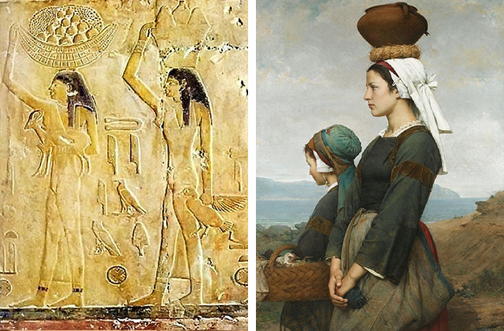
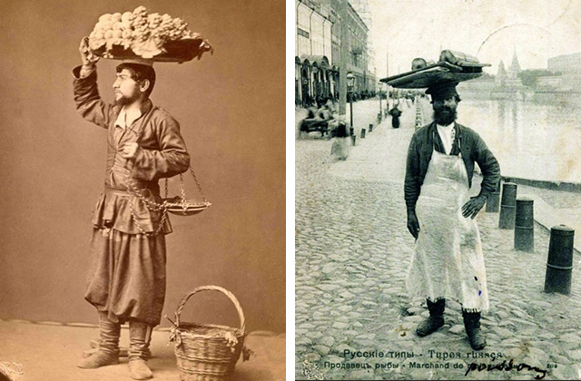

**ОТКУДА ПОШЛА ПРИВЫЧКА НОСИТЬ ГРУЗЫ НА ГОЛОВЕ?**

Для современного человека, привыкшего к сумкам, портфелям, рюкзакам и авоськам, перенос грузов на голове кажется по меньшей мере странным. Между тем именно такой способ в прошлом был распространен во всех уголках мира, включая Россию. Нельзя сказать, кто первым его придумал, но уже на древнеегипетских фресках подобные сюжеты встречаются постоянно. Причин его популярности было несколько.

 

Во-первых, исследования физиологов доказывают, что перенос тяжестей на голове — самый экономичный способ для человеческого организма. Усилий затрачивается в разы меньше, так как голова едва поднимается и опускается, за счет чего груз почти не колеблется.

Во-вторых, так можно поднять гораздо больший вес, чем в руках: тяжесть груза распределяется по позвоночнику, а не перевешивает в одну сторону. Кроме того, идти с прямой спиной гораздо удобнее. Например, женщины кенийского племени луо способны носить груз, равный почти 70% веса их тела. При этом они расходуют энергии в два раза меньше, чем тренированный солдат, совершающий марш-бросок с аналогичной нагрузкой! В Индии есть даже такая услуга, когда за небольшую плату специальный человек поможет поставить мотоцикл на крышу автобуса. То есть для него не проблема поднять на голове вес в 150 кг.

В-третьих, руки остаются свободными, что особенно важно для женщин, которым вечно нужно делать массу дел одновременно. Да и товар на голове торговца виден покупателю как на витрине.

 

Наконец, в-четвертых, если привыкать к переноске грузов на голове с детства, вырабатывается не только правильная осанка, но и красивая, ровная походка. Не случайно африканки и женщины Юго-Восточной Азии так долго сохраняют стройность.

Чтобы практиковать такой способ переноски, нужна не только тренировка, но и, как правило, небольшое приспособление: матерчатый или травяной валик или головной убор с ровной поверхностью, на которую можно ставить груз. Их предназначение — смягчать давление на голову и делать положение груза более устойчивым. Например, русские носильщики для этой цели использовали картузы. Не исключено, что такой распространенный в странах Востока головной убор, как тюрбан, также произошел от головного валика для переноски груза.

А грузинские кинто (разносчики вина) не только носили груз подобным образом, но даже включили в свой традиционный танец кинтаури соревнование, во время которого нужно выполнять движения, держа на голове бутылку вина!

По-видимому, с распространением городской культуры подобный способ становился все менее престижным — не будет же подлинный аристократ носить что-либо тяжелее носового платка! Так за какие-то сто лет традиция переноса груза на голове практически исчезла из нашей повседневности.

